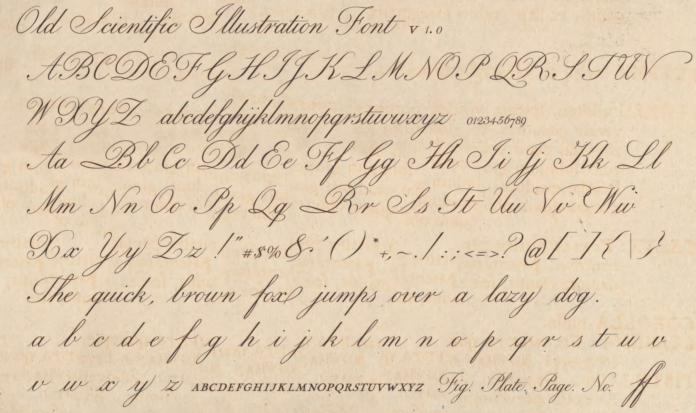
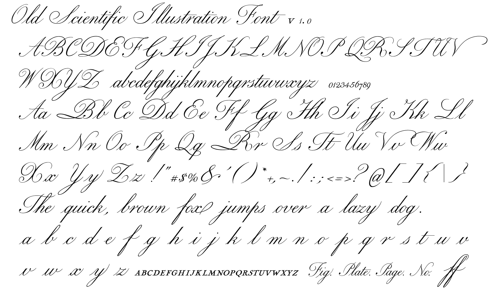
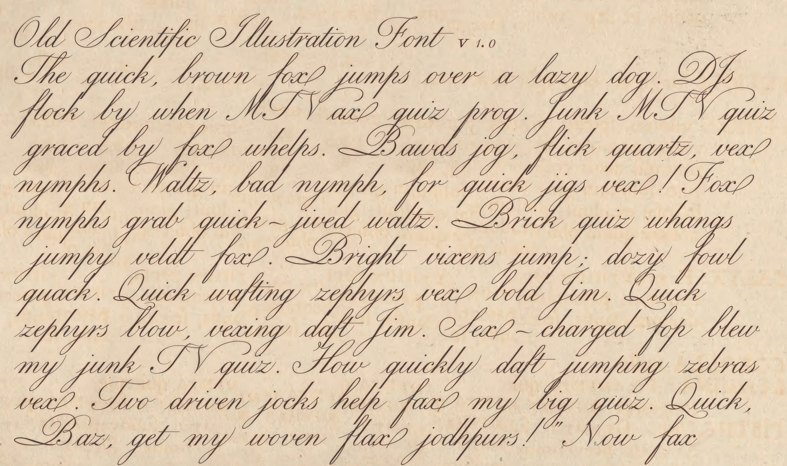

# Old Scientific Illustration Font

[Download this font (it's free!)](https://github.com/boxbot6/old-scientific-illustration-font-v1/raw/main/downloads/old-scientific-illustration-font-v1.zip)

 

.png)

 

This font is specially designed so that the decorative script features also work properly in graphics programs such as Inkscape, GIMP etc. (Many graphics programs struggle with showing anything except only the base characters of some regular fonts and so using them for illustration and design purposes can be very frustrating and time-consuming as you may have to replace these manually with the alternative contextual characters you want. (Techie tip: this modified font works because it contains only GSUB 'clig' lookups in place of all the other types of GSUB or GPOS lookups and kearning - lookups contained in a font are used to automatically show alternative characters, effects and spacing dependent on the surrounding text) - hopefully this fix will also work across a large variety of other platforms.

**note:** These script effects are basically locked into this font, however there could be situations where you wish to override them - please install and use the `OldScientificIllustrationRaw.ttf` version of the font for these situations - it's stripped of all the automatic font effects and so its characters are rendered inert and can be intermixed with the standard version where fixed specific characters are required without them being altered by their surrounding context (you can select and import them using Windows character map). This raw version can on rare occasions become jammed on and dominant in GIMPs font selector, if you can't switch back to the standard version of the font then temporarily uninstall this raw version to do so.

The font design is based on the engravings contained in the botanical series Flora Londinensis by William Curtis which was first published in 1777 and is very similar in appearance to many scripts used in other scientific illustrations of the period.

Being a formal script type font having multiple variants of each letter with different joining-points as well as also having swishes, flourishes, tails, style alternatives and additional characters it has many more glyphs included than are usual in a simple font.

(I've trouble-shot it multiple times and ironed out most of the glyph-joining, substitution and positioning glitches but it probably still contains a few bugs especially with some unusual combinations of letters/characters that I haven't tried - you can try using the raw version to repair these if they occur). 

It was partly made with FontForge - it's free and you can use that to try and sort out anything I missed -I apologise for the list of lookups being rather bloated and illogical, but for use in GIMP I had to keep all the internal programming in GPOS 'clig' and the lookup order is critically important for it to function correctly - it was much easier to just keep adding bits to it in order to fix all the minor bugs.

(The above image shows just a sample of the glyphs that this font contains - download and open `old-scientific-illustration-font-v1-character_map.pdf` in a suitable viewer, use Character Map in Windows or open the font in a font editor to view the full set of glyphs).

The font also contains a smallcap alphabet and a set of standalone lowercase characters for use in scientific labelling. It also has an extra set of alternative numerals with which you can avoid number sequences becoming repetitive - you can pick these individually using character map in Windows.  

Otherwise typically install and use it as you would any other TrueType font (.ttf) (please see details in the How to guides below) - for the seperate characters you can also use FontForge to create .svg's (image files) for all the individual glyphs as explained in 'Helpful Font Tips'.

 

## Old Scientific Illustration Font, Graphics Font, GIMP Font, Old Script, Scientific, TTF, Free.
## Files included in the download:
* OldScientificIllustration.ttf
* OldScientificIllustrationRaw.ttf
* old-scientific-illustration-font-v1-character-map.pdf
* old-scientific-illustration-font-v1-example-1.png
* old-scientific-illustration-font-v1-example-2-(monochrome).png
* old-scientific-illustration-font-v1-example-3-(body-of-text).png
* old-scientific-illustration-font-v1-example-4-(illustrations).png
* Helpful_Font_Tips.txt

 

[Download (.zip)](https://github.com/boxbot6/old-scientific-illustration-font-v1/raw/main/downloads/old-scientific-illustration-font-v1.zip)

 

**Font Type:** Formal Script

**Font Weight:** Normal

 

## Helpful Font Tips:

 

How to install and use in Windows:
- Download and unzip the folder containing the new font.
- Install the font as administrator by right-clicking the .ttf file and selecting 'Install for all users' checking it has the administrator shield shown next to it - (installing for all users as an administrator is recommended because it can help to resolve problems with fonts not listing correctly in some third-party programs like Inkscape, GIMP etc.).
- To use - select the new font from inside the program where you wish to use it (if it doesn't appear in the list of available fonts, open Windows 'Font Settings' to see if it is installed OK on the system - if it isn't please try re-installing again using different administrative privileges/method - If it is installed try using it in other programs such as Notepad or Word to check if it's working OK elsewhere, this will allow you to track the problem to a particular program).

If you still have problems please try the options below:
- Double tap/click on the .ttf file to open a preview window of the font to visually check if it is a valid font, click on install here as an alternative installation method.
- Close and restart the program that doesn't show the font (once restarted check to see if it shows the other installed fonts?)
- Restart the computer to reboot Windows (refreshes all the windows installed fonts and programs).
- Possibly try editing a font that the original program does recognise with elements from the new font or by substituting the font that does work completely with a copy of the new font renamed to imitate it and placed in its original location (some programs use embedded fonts so the working fonts location could be in a different place than all the other windows fonts (this could be why the new font didn't work with this program?)).
- If these fixes don't work you may have to switch to an alternative program that the font does work with.
- Once the font is working use Windows Character Map to easily find, select and copy non-keyboard characters that you want to use and then paste them into your work.
- Don't forget to embed, link to or include the new font with your finished work when exporting it to use elsewhere.

 

How to edit a font:

To edit a whole font or just change some of the individual characters open it in a free font editor like FontForge where you can see all the glyphs contained in the font and edit or copy the characters to create a new font. (FontForge can also be used to make .svg images from all the glyphs in a font (described below) which you can then use in online font editors like IcoMoon etc.).

 

How to create seperate .svg's (image files) of all the icons in a font (using FontForge):
- Run FontForge as administrator - important it will not work otherwise!
- Open the font that you wish to create image files from.
- Select File/Execute Script/- copy and paste the script code below into the dialog box there:

      SelectWorthOutputting(); foreach Export("svg"); endloop;

- Select FF, then press OK. - by default the .svg outputs are generated to: "C:\Program Files (x86)\FontForgeBuilds")
- For neatness put all the files generated into to a new folder so that they don't get mixed up with other outputs you might create later. Use them online or in a suitable graphics program that can edit .svg's such as Inkscape. 
- If it doesn't work? - check you are using FontForge as administrator and that you are looking for the output files in the correct place (if you installed FontForge in a different directory look there).

 

How to embed and use a font in an HTML website:
- Make a new folder named 'fonts' in your main html folder (root directoy) - put your new font there.
- Add the following code between \<head\> and \</head\> at the top of your index.html file (open it using Notepad or similar) or else if your website uses a .css file, put the code there without the \<style\> and \</style\> surrounding it).

      <style>
      @font-face {
      font-family: your_new_font_name_here;
      src: url(fonts/your_new_font_name_here.ttf); /* Relative url that points to the fonts folder */
      }
      </style\>

- Use the following code in your index.html to display the font in a new paragraph - (Helvetica, Arial and sans-serif are just included in the code as good practice alternatives if a font cannot be found (the font-size and color can of course be changed to whatever you want).

      
This paragraph uses the style @font-face.

 

How to use in Apps:
- Open your App in Android Studio and create a new font folder: app/res/font - then copy your-new-font-name-here.ttf to it.
- Reference the font where you want to use it in your layout using: android:fontFamily="@font/your-new-font-name-here"

 

 

.png)

 

.png)

 
 

Click the link below to visit the GitHub repository that is being used to generate this site:

<https://github.com/boxbot6/old-scientific-illustration-font-v1>

 
